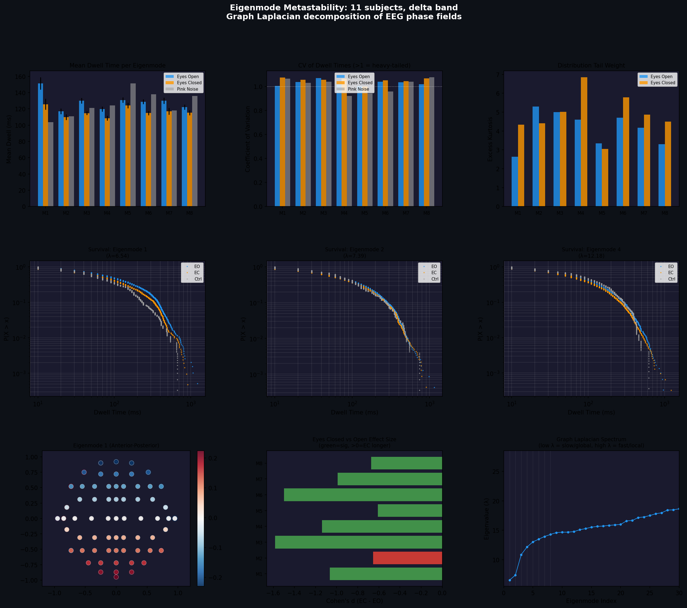
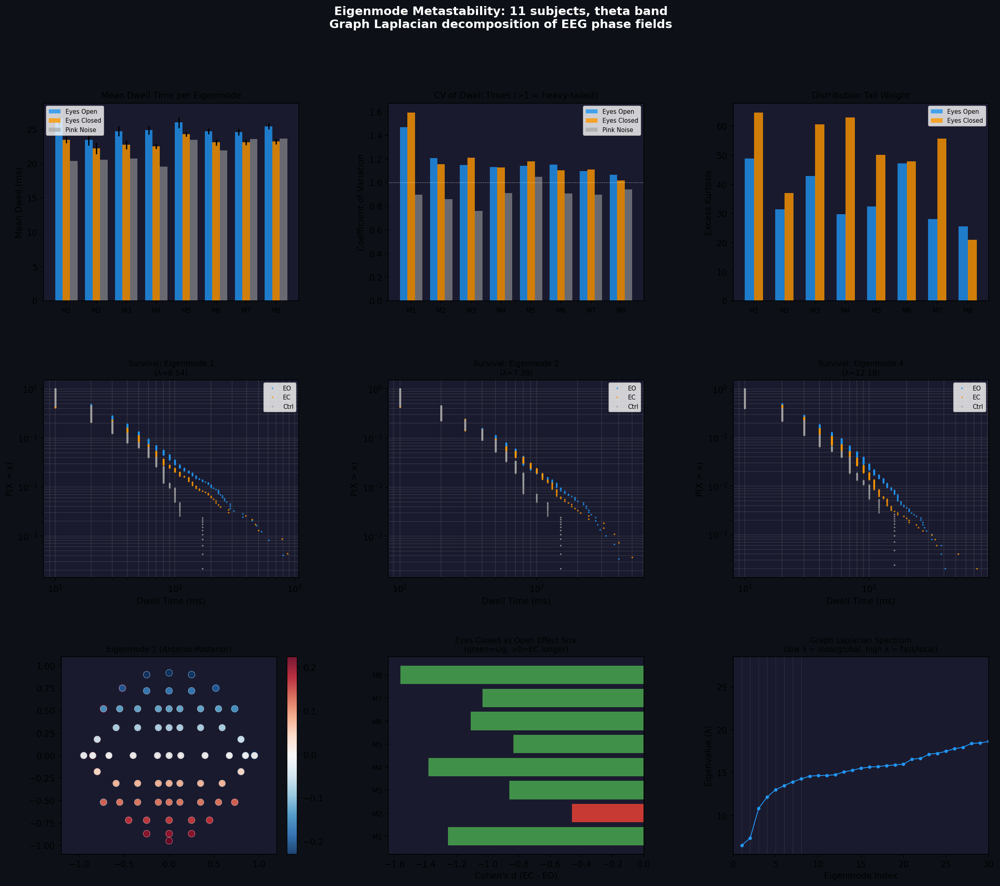

# Φ-Dwell: Eigenmode Phase-Field Metastability Analyzer

Measuring how long the brain holds a thought — through the geometry of its electrical fields

Φ-Dwell decomposes scalp EEG phase dynamics into spatial eigenmodes of the electrode graph Laplacian
and measures the temporal persistence (dwell time) of coherent phase-field orientations within each mode.
It reveals band-specific dynamical regimes, state-dependent metastability signatures, and a frequency
hierarchy that bridges holographic brain theory with modern spectral graph neuroscience.

# What It Does

Traditional EEG analysis measures power — how loud each frequency is. Φ-Dwell measures something different:
how long the spatial pattern of phase relationships holds a coherent orientation before transitioning to a new one.

# The tool:

Builds a graph Laplacian from electrode positions and computes spatial eigenmodes
Bandpass-filters EEG into standard frequency bands (delta through gamma)
Extracts instantaneous phase via Hilbert transform
At each time window, projects the phase field onto each eigenmode
Tracks eigenmode coefficient trajectories over time
Identifies "dwells" (periods of stable phase-field orientation) and "transitions"
Computes dwell-time distributions, comparing conditions against pink noise controls

The output: dwell-time statistics per eigenmode, per frequency band, per condition — with survival 
functions, effect sizes, and statistical tests across subjects.

# Key Findings (11 subjects, PhysioNet EEG Motor Movement/Imagery Dataset) (see pictures) 

The Five-Band Hierarchy

Mean dwell times for Mode 1 (anterior-posterior eigenmode), eyes-open condition:

Delta

Theta

Alpha 

Beta

Gamma

The brain's slowest rhythms create spatial phase patterns that persist 13× longer 
than its fastest. This is Baker & Cariani's oscillatory cascade measured through eigenmode phase geometry.

# The Alpha–Theta Double Dissociation

BandEyes OpenEyes ClosedDirectionTheta26.5 ms23.5 msEO > EC (p = 0.008)Alpha16.3 ms21.1 msEC > EO (p = 0.068)

Theta dwells longer when the eyes are open (active visual exploration sustains theta sweeps). Alpha dwells 
longer when the eyes are closed (the cortical idle rhythm creates a stable standing wave). These opposite
directions in adjacent frequency bands rule out any generic artifact — no signal processing confound produces 
reversed effects in two bands on the same data.

# Three Dynamical Regimes

The coefficient of variation (CV) and excess kurtosis reveal qualitatively different dynamics:

Delta — CV ≈ 1.0, kurtosis ≈ 6. Near-exponential. Transitions are semi-independent, like a Poisson process.

Theta/Alpha — CV ≈ 1.2–1.5, kurtosis ≈ 30–70. Heavy-tailed power law. The system sits near criticality with
occasional very long coherent episodes. This is the metastability signature.

Beta — CV ≈ 1.0–1.6, kurtosis ≈ 100–500. Extremely heavy tails on a short mean. Rare but extraordinarily
long dwells mixed with rapid transitions. This is beta bursting captured through phase geometry.

Gamma — CV ≈ 0.4–0.6. Sub-exponential (more regular than random). Gamma transitions happen at a semi-clocklike pace,
consistent with local interneuron circuit timing.

# Delta's Spatial Intelligence

In delta band, the brain's global eigenmodes (Mode 1: 151 ms) dwell far longer than noise, while fine-scale eigenmodes
(Mode 5: 131 ms) dwell shorter than noise (151 ms, p = 7 × 10⁻⁶). The brain actively concentrates delta dynamics 
in the lowest spatial modes while suppressing fine-grained delta coherence. Pink noise doesn't do this — it has no spatial intelligence.

# Theoretical Framework

Φ-Dwell sits at the intersection of four research programs:
Pribram's Holographic Brain Theory (1971)
Karl Pribram proposed that the brain stores and processes information through wave interference patterns distributed across
neural tissue — a "holographic" encoding where spatial phase relationships carry information. Φ-Dwell constructs exactly this 
kind of holographic field from scalp EEG phases and measures its temporal dynamics.

Pribram, K. H. (1971). Languages of the Brain. Prentice-Hall.

Wang et al. — Spectral Graph Theory of the Structural Connectome (2017)

The brain's white-matter connectivity defines a graph whose Laplacian eigenmodes form a natural spatial basis for 
neural dynamics. Low eigenmodes capture global, slowly-varying patterns; higher eigenmodes capture finer spatial structure.
The eigenvalues 1/λᵢ predict characteristic timescales for each mode. Φ-Dwell's graph Laplacian eigenmodes are the 
electrode-geometry analog of these connectome eigenmodes.

Wang, M. B., Owen, J. P., Mukherjee, P., & Bhatt, P. (2017). 

Brain network eigenmodes provide a robust and compact representation of the structural connectome in health and disease.
PLoS Computational Biology, 13(6), e1005550. https://doi.org/10.1371/journal.pcbi.1005550

Baker & Cariani — A Time-Domain Account of Brain Function (2025)

Neural information processing operates through temporal wave interference with an oscillatory cascade from fast
(gamma) to slow (delta) bands. Each stage represents a deeper level of cognitive processing. Delta sits
at the top of the hierarchy, carrying the most integrated, persistent states. Φ-Dwell's dwell-time hierarchy 
(delta 151 ms → gamma 12 ms) is a direct measurement of this cascade through eigenmode phase persistence.

Baker, D. B. & Cariani, P. A. (2025). Listening to the brain: A time-domain account of brain function and dysfunction. Preprint.

Vollan et al. — Theta Sweeps in Entorhinal–Hippocampal Maps (2025)

Grid cells in the medial entorhinal cortex produce linear "sweeps" outward from the animal's position within
individual theta cycles (~125 ms), alternating left-right across successive cycles. Sweep lengths scale 
with grid module spacing — a multi-scale spatial decomposition that maps onto the eigenmode hierarchy. Φ-Dwell's
theta dwell time (~107 ms in the original dataset, ~27 ms per eigenmode in the multi-subject study) is consistent 
with the theta-cycle timescale of this sweep mechanism.

Vollan, A. Z. et al. (2025). Left–right-alternating theta sweeps in entorhinal–hippocampal maps of space.
Nature, 639, 196–205. https://doi.org/10.1038/s41586-024-08511-5

# The Synthesis

These four frameworks connect into a single mechanistic chain:
Grid module spatial scales (Vollan)
        ↓
Eigenmode hierarchy of the structural connectome (Wang)
        ↓
Oscillatory cascade from fast to slow bands (Baker & Cariani)
        ↓
Holographic phase-field persistence measurable from scalp EEG (Pribram → Φ-Dwell)
Φ-Dwell provides the measurement layer that connects the others. The dwell-time hierarchy across five frequency bands,
the band-specific dynamical regimes, and the state-dependent reversals (theta vs alpha) are predictions of this combined
framework that Φ-Dwell empirically tests.

# Method

Eigenmode Construction

Given N electrode positions on the scalp, construct:

Adjacency matrix via Gaussian kernel: A_ij = exp(−d²_ij / 2σ²)
Degree matrix: D_ii = Σⱼ A_ij
Graph Laplacian: L = D − A
Eigendecomposition: L = V Λ V^T

The first eigenvector (λ₀ = 0) is constant and discarded. Eigenvectors 1–8 form the spatial basis. With 64 channels and σ = 0.5:

ModeλSpatial PatternInterpretation16.54y-corr = −0.999Anterior ↔ Posterior27.39x-corr = −0.989Left ↔ Right hemisphere310.87
Center vs peripheryMidline ↔ Temporal412.18Diagonal crossQuadrant pattern5–813.0–14.3Higher-orderProgressively finer
Phase-Field Projection 

For each time window (250 ms, 10 ms step):

Bandpass filter EEG into target band

Hilbert transform → instantaneous phase φₙ(t) per channel

Project phases onto eigenmodes: cₘ(t) = Σₙ exp(iφₙ(t)) · vₘ(n)

Track complex coefficient cₘ(t) = |cₘ| exp(iθₘ) over time

Dwell Detection

The angle θₘ(t) of each eigenmode coefficient traces the dominant orientation of the phase field projected onto 
that spatial mode. A dwell occurs when θₘ changes by less than a threshold (default: π/4) between successive windows. 
A transition occurs when it exceeds the threshold.

Dwell times are collected across all windows, yielding a distribution per mode, per band, per condition.

Controls

Pink noise control: For each subject, 1/f noise (matching EEG spectral profile) is generated for 64 independent 
channels and processed through the identical pipeline. This establishes the dwell statistics expected from a signal
with realistic spectral properties but no spatial phase organization. The brain must exceed this baseline to claim structured dynamics.

Statistics

Paired t-tests across subjects for mean dwell differences (Eyes Open vs Eyes Closed, Brain vs Noise)
Kolmogorov-Smirnov tests on pooled dwell distributions for distributional differences
Coefficient of variation (CV > 1 → heavy-tailed, CV < 1 → regular)
Excess kurtosis for tail weight characterization

Usage
Requirements
Python 3.10+
numpy
scipy
matplotlib
mne (for EDF file reading)

Basic Commands
bash# Single band, 20 subjects
python eigenmode_metastability.py "path/to/eegmmidb/1.0.0" --band alpha --subjects 20

# All five bands, all subjects

python eigenmode_metastability.py "path/to/eegmmidb/1.0.0" --subjects 109 --all

# Single band, all subjects

python eigenmode_metastability.py "path/to/eegmmidb/1.0.0" --band theta --subjects 109

Dataset
Designed for the PhysioNet EEG Motor Movement/Imagery Dataset:

109 subjects, 64 channels (10-10 system), 160 Hz
R01: Eyes open baseline (1 min)
R02: Eyes closed baseline (1 min)
R03–R14: Motor execution and imagery tasks

Download:

bashwget -r -N -c -np https://physionet.org/files/eegmmidb/1.0.0/

Output

For each run, the tool produces:

Console table: Mean dwell times, t-statistics, p-values, CV per mode

PNG figure with 9 panels:

Mean dwell time per eigenmode (EO/EC/Noise)

CV of dwell times per eigenmode

Excess kurtosis per eigenmode

Survival functions for Modes 1, 2, 4 (log-log)

Eigenmode 1 spatial map (topographic)

Effect size bar chart (Cohen's d, EC − EO)

Graph Laplacian spectrum

# Processing Speed

~13,000 windows/sec per subject. Full pipeline (109 subjects × 2 conditions × 1 band) completes in ~30 minutes on a standard machine.

Adapting to Other Datasets

The tool supports both 64-channel (10-10) and 20-channel (10-20) electrode systems. For other montages, add electrode 
positions to the ELECTRODE_POS_64 or ELECTRODE_POS_20 dictionaries in the source. The graph Laplacian construction adapts automatically.

# What This Is and What It Isn't

What it measures: Temporal persistence statistics of scalp-level holographic phase fields projected onto spatial eigenmodes. 
These are macroscopic signatures — the aggregate behavior of millions of neurons integrated across cortex and
volume-conducted through skull and CSF.

# What it does not measure: 

Individual neural events. Unlike Neuropixels recordings that resolve single-cell activity with millisecond precision, 
scalp EEG captures coarse spatial averages. Φ-Dwell detects the statistical signature of mechanisms like theta sweeps
(Vollan et al.), not individual sweeps.

# The honest claim: 

Eigenmode phase-field dwell statistics reveal band-specific dynamical regimes and state-dependent metastability 
patterns that are consistent with predictions from spectral graph theory, oscillatory cascade models, and the entorhinal theta
sweep mechanism. The alpha–theta double dissociation and the five-band hierarchy cannot be explained by generic signal processing artifacts.

# Citation

If you use Φ-Dwell in your research, please cite:

Φ-Dwell: Eigenmode Phase-Field Metastability Analyzer (2025)

[https://github.com/[repository]](https://github.com/anttiluode/BrainMetastabilityAnalyzerTool/)

License
MIT

Acknowledgments
Developed through collaborative research sessions between Antti Biström (PerceptionLab) and Claude (Anthropic), February 2025.
Built on foundations laid by Pribram, Wang, Baker, Cariani, Vollan, and their collaborators. Validated on the PhysioNet EEG Motor
Movement/Imagery Dataset (Goldberger et al., 2000; Schalk et al., 2004).
